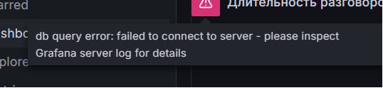
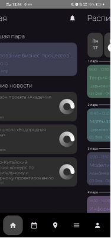
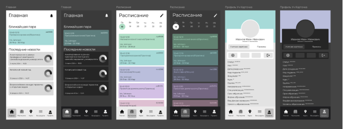
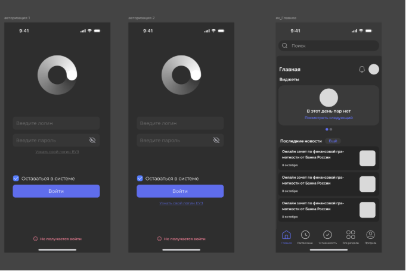

**Заказчик проекта**

Московский политехнический университет. Контактное лицо со стороны заказчика: Захаров Илья Андреевич	

**Описание деятельности МосПолитеха**

Московский политехнический университет (Московский Политех) — один из ведущих вузов России, основанный в 1865 году. Это крупный многопрофильный вуз, который осуществляет подготовку востребованных на рынке труда специалистов в различных сферах: от IT до дизайна, от инженерии до менеджмента, от экономики до журналистики и издательского дела. 

Вуз предоставляет практическое образование с возможностью решения реальных задач, участием в реализации интересных проектов, профессиональных конкурсах, соревнованиях и зарубежных стажировках, а также широкие возможности трудоустройства в перспективные компании еще в процессе обучения. Одна из самых важных сторон обучения в университете – проектная деятельность. Цель проектного обучения – всесторонне подготовить студентов к реалиям современной индустрии. Каждый год в университете реализуется более 100 проектов. Студенты проектируют автомобили и мотоциклы, собирают 3D-принтеры, реализуют проекты по вторичной переработке, занимаются 3D моделированием зданий и объектов энергетики. Значительная часть проектов реализуется совместно с индустриальными партнерами, и это отличный шанс положительно зарекомендовать себя еще во время обучения. Студенты, благодаря полученным в университете знаниям, конструируют электромотоциклы, которые участвуют в международных соревнованиях Smart Moto Challenge, создают гоночные автомобили класса Formula Student, участвуют в профессиональных гонках на выносливость Russian Endurance Challenge, занимаются подготовкой гражданского автомобиля Kia Pro Ceed к участию в Российской серии кольцевых гонок в классе Туринг-лайт. Политех старается создать условия для развития и самосовершенствования личности студента, приобретению коммуникативных, организаторских, творческих навыков, которые пригодятся после окончания университета.

Насыщенная на мероприятия внеучебная деятельность делает студенческую жизнь яркой и запоминающейся. Волонтерский центр, профсоюзная организация, педагогический отряд, творческая мастерская, танцевальные коллективы, вокальная студия и другие студенческие объединения готовы принять всех неравнодушных и инициативных студентов. Особое внимание в университете уделяется развитию студенческого спорта. На сегодняшний день кафедрой «Физическое воспитание» и Студенческим спортивным клубом обеспечивается учебно-тренировочный процесс сборных команд по 33 видам спорта от баскетбола до пауэрлифтинга и мини-футбола, а число культивируемых видов спорта регулярно увеличивается. Сборные, показывающие наилучшие результаты, направляются на международные соревнования, где успешно подтверждают свой высокий уровень. Все успехи студентов поощряются. Активисты в различных сферах – от учебы «на отлично» до успехов во внеучебной деятельности – получают повышенную академическую стипендию до 21 тыс. рублей. На базе вуза также работают образовательный, культурный и спортивно-технический центр «Полет», яхт-клуб и центр подготовки водителей (автошкола).

**Основная часть**

**Актуальность и проблематика**

Цифровизация стала неотъемлемой частью современного мира, и образовательные учреждения вынуждены адаптироваться к новым реалиям, чтобы соответствовать требованиям студентов, преподавателей и общества в целом. Цифровые технологии кардинально меняют подход к образовательному процессу, делая его более гибким и доступным. Современные студенты ожидают от университетов возможности обучаться онлайн, получать доступ к учебным материалам в любое время и с любого устройства. 

Понятие Цифрового университета базируется на принципе цифровой трансформации ключевых процессов вуза с учетом новых экономических тенденций. Для оптимизации и автоматизации бизнес-процессов вуза создаются различные сервисы. Вузы также подключают к внедрению ИТ-сервисов для цифрового университета студентов, так как они горят новыми идеями, а для студентов это отличная практика.

**Суть, цели, задачи**

Целью проекта является увеличение продуктивности студентов и сотрудников, обеспечив более удобное и эффективное взаимодействие с сервисами Московского политеха за счёт их разработки, внедрения и модернизации.

В рамках проекта мы рассматриваем 6 подпроектов:

1. личный кабинет Московского политеха;
1. мобильное приложение личного кабинета на базе Android;
1. мобильное приложение личного кабинета на базе IOS;
1. сервис визуализации данных контакт-центра Московского политеха на базе Grafana;
1. «Политайм»;
1. система парсинга и анализа данных.

   **Личный кабинет**

- В рамках личного кабинета нужно:
- взаимодействовать с техническим руководителем и разработчиками для передачи выявленных ошибок и их устранения;
- набрать команду фронтэнд-разработчиков среди студентов;
- исправлять баги и разрабатывать сервисы согласно ТЗ от технического руководителя.

  **Сервис визуализации данных колл-центра**

  Цель проекта: развернуть систему сбора и визуализации статистических данных для мониторинга работы контакт-центра.

  Проект разделяется на этапы:

  **1 Этап.** Разворачивание Grafana на серверах МП.

  **2 Этап**. Получение данных из базы телефонии напрямую в Grafana и настройка визуализации.

  **3 этап.** Создание промежуточной среды для сбора данных.

  Сейчас мы находимся на 3 этапе. Промежуточная среда сбора данных необходима для связи с приложением Queue, которое не отправляет данных напрямую базе данных.

  Для сервиса визуализации данных были поставлены следующие задачи:

- Установить Asterisk Management Interface(AMI).
- Обозначить и изучить необходимые данные для оставшихся запросов.
- Вытянуть необходимые данные из asterisk через AMI.
- Собрать и визуализировать необходимые данные в Grafana.

  **Мобильное приложение личного кабинета на базе Android**

  На данный момент пользование сайтом нашего университета с мобильного устройства создает ряд неудобств. Нужно каждый раз писать адрес в поисковик, заново входить в личный кабинет, а также заходить по абсолютно другой ссылке чтобы, например, получить информацию о структуре университета. На самом же сайте среди мелкого текста искать нужный раздел, среди огромного количества ссылок, разной степени полезности.

  Можно сделать вывод, что использование мобильного приложения, посвященного Московскому политехническому университету, не только упростит восприятие информации на мобильном устройстве, но и позволит пользователю оперативно взаимодействовать с множеством интерактивных элементов сайта. 

  Нашим проектом является процесс продвижения и представления деятельности ВУЗа в мобильной среде, процесс разработки и внедрения удобного мобильного приложения, предназначенного для студентов, преподавателей и сотрудников университета. Это комплексная работа, направленная на удовлетворение потребностей студентов и преподавателей в доступе к информации и удобстве пользования технологий в образовательном процессе. 

  В этом семестре перед нами поставлена цель разработки MVP приложения для iOS, а также доработка и публикация приложения для ОС android. Для выполнения данных целей в работе определены следующие задачи:

- разработать дизайн для новых модулей;
- определить части проекта, нуждающиеся в доработке до релиза android-версии;
- исправить все найденные недоработки;
- изменить интерфейс приложений до полного соответствия с разработанным дизайном;
- провести тестирование приложений, исправить баги;
- представить проект на защите.

  **Мобильное приложение личного кабинета на базе IOS**

  Суть проекта: Создание приложение личного кабинета Московского Политехнического Университета для пользователей IOS(Iphone) на базе языка программирования SwiftUI.

  Цель: Создать первые функции и обновить дизайн приложения

  Задачи: 

  - изучить разработки, сделанные предыдущей командой;

  - найти и изучить учебные материалы для расширения возможностей команды;

  - обновить дизайн экранов и выдержать корпоративную стилистику;

  - изучить данные поступающие через API от личного кабинета студента;

  - сверстать экраны, подготовленные дизайнерами;

  - написать скрипты для использования и отправки данных API;

  - подготовить черновой вариант функций приложения;

  - спланировать дальнейшую работу в проекте и составить документацию по текущему проекту. 

  Этапы реализации: 

1. Анализ и изучение материалов.
1. Планирование и распределение обязанностей.
1. Подготовка среды для разработки.
1. Выполнение поставленных задач.
1. Оценка работы и планирование следующего этапа разработки.

   **Политайм**

   Актуальность проекта заключается в необходимости студентов отслеживать актуальную информацию по предметам, заданиям по ним и индивидуальным задачам, из-за отсутствия такого функционала в существующих систем ВУЗа. ПО решает проблему потери и искажения информации, что в свою очередь повышает эффективность студентов и позволяет им тщательнее распределять задачи и планировать время выполнения.

   Суть проекта заключается в создании продукта, который будет хранить расписание, задачи, добавляемые старостой, индивидуальные проекты и иную активность студентов, отображать ее в удобном виде с помощью графического интерфейса, с возможностями фильтрации, сортировки и тонкой настройки.

   Цель проекта помочь студентам всегда получать актуальную информацию и не терять ее. К основным задачам проекта можно отнести:

   - получение расписания для студентов разных групп;

   - получение и отслеживание задач (домашние работы, практические работы, лабораторные работы, индивидуальные задачи и проекты);

   - фильтрация и сортировка информации каждым студентом под себя;

   - функции оценки сложности и приоритетности задачи;

   - возможность закрыть или отложить задачу, а также убрать выполненные задачи из списка или показать;

   - для старосты ПО поможет отслеживать список своей группы, обновляя его, удаляя или добавляя студентов.

   Этапы реализации:

1. Формирование идеи и анализ требований.
1. Разработка базы данных и серверной части.
1. Проектирование макета.
1. Разработка клиентской части.
1. Тестирование.
1. Внедрение.

   **Система парсинга и анализа данных**

   Разработка системы парсинга и анализа данных направлена на автоматизацию сбора, обработки и анализа информации из различных источников (новостные сайты, патентные базы и т. д.) в области наземного транспорта. Система позволит извлекать актуальные данные, структурировать их, удалять дубликаты и на основе этой информации генерировать статьи и дайджесты, а также выделять сущности. Это поможет специалистам и исследователям оперативно получать аналитические материалы и отслеживать тенденции в отрасли.

   Основной целью разработки является создание автоматизированной системы, которая обеспечивает сбор данных из разнородных источников, структурирует и анализирует полученные данные, выделяет сущности и генерирует аналитические материалы (статьи, дайджесты) на основе обработанной информации.

   Для достижения поставленной цели необходимо решить следующие задачи:

- Создание модуля для сбора данных с различных веб-ресурсов.
- Обеспечение поддержки разнородных структур сайтов.
- Очистка данных от дубликатов и нерелевантной информации.
- Извлечение ключевых сущностей (например, названия технологий, компаний, дат, локаций) с использованием моделей NLP.
- Разработка модуля для выделения сущностей, создания статей и дайджестов на основе обработанных данных.
- Объединение всех модулей в единую систему.
- Тестирование системы на реальных данных.

  **Описание полученных результатов выполненных задач**

  **Личный кабинет**

  В прошлом семестре была создана таблица багов на базе Google Таблиц. Всего было найдено 57 багов на различных операционных системах и в разных браузерах. Теперь необходимо направить силы на исправление багов со стороны разработчиков. Технический руководитель выдвинул требования для фронтэнд-разработчиков, которые нужны в текущую техническую команду нового личного кабинета:

  - уверенное знание React, 

  - базовые знания TypeScript,

  - опыт работы с Effector,

  - базовые знания styled-components,

  - владение Responsive design,

  - владение Feature sliced design,

  - базовое знание Git,

  - базовые знания работы с API.

  Будет плюсом:

  - глубокие знания CSS,

  - широкие знания HTML,

  - знания Web accessibility.

  Из ребят сейчас направил свое резюме Никитин Руслан Романович, ждём ответа от технического руководителя.

  **Сервис визуализации данных колл-центра**

  В середине февраля в Московском Политехе произошёл глобальный сбой серверов, который коснулся всего документооборота и сервиса визуализации данных в частности. Произошёл сбой в доступе к базе данных колл-центра. Были установлены пароли по умолчанию, из-за чего доступ к базе данных оказался для нас закрыт (рис. 1).

  

  Рисунок 1 – Ошибка доступа к базе данных колл-центра

  После переговоров с технической группой и подрядчиками доступ к базе данных был восстановлен.

  Технической группой был развернут AMI [1] на сервере, где находится Grafana, на порте 5038. Сейчас мы пытаемся подключится к AMI через TCP.

  **Мобильное приложение личного кабинета на базе Android**

  улучшили меры безопасности/сохранности пользовательских данных внутри приложения. Была найдена недоработка в процессе аутентификации пользователя на стороне сервера, в следствие чего был имплементирован новый способ хранения личной информации в приложении, дабы избежать утечки данных;

  был имплементирован свайп-пейджер на вкладках внутри приложения, который функционирует наряду с навигационной панелью, для увеличения комфорта пользования (рис. 2);

  

  Рисунок 2 – Свайп-пейджер для мобильного приложения

  были исправлены различные найденные внутри уже сделанных модулей визуальные баги, обнаруженные командой тестировщиков;

  был разработан сплеш экран для приложения, улучшающий пользовательский опыт;

  имплементированы иконки для приложения, соответствующие современным гайдлайнам дизайна ОС android.

  **Мобильное приложение личного кабинета на базе IOS**

  На данный момент выполнена только часть задач, относящаяся к планированию и начальной стадии разработки. Команда разработчиков сейчас занимается изучением данных в API и верстает черновые экраны для будущих функций, команда дизайна же занята постепенной проработкой каждого из экранов.

  Со стороны дизайна ведётся редизайн с прошлого семестра с учётом гайдлайна IOS со светлой и тёмной темами.

  

  Рисунок 3 – Страницы «Главная», «Расписание» и «Профиль»

  

  Рисунок 4 – Другой вариант навигационной панели и страницы «Авторизация» и «Главная»

  **Политайм**

  В ходе работы была разработана база данных, а MVP серверной части:

  - документация API (рис. 5);

  - регистрация и авторизация с использованием jwt токенов (access и refresh);

  - подтверждение почты, рассылка email’ов;

  

  Рисунок 5 – API аутентификации

  - получение расписания(рис. 6);

  

  Рисунок 6 - API расписания

  - получение списка предметов и типов задач (рис. 7);

  

  Рисунок 7 - API типов задач и предметов

  - получение списка задач для группы и индивидуальных задач;

  - добавление групповой задачи старостой и индивидуальной задачи студентом;

  - удаление и изменение задач;

  - фильтрация и сортировка задач;

  - выполнение задачи и отмена выполнения (индивидуально для каждого пользователя);

  - добавление и изменение заметок к задачам (индивидуально для каждого пользователя) (рис. 8).

  

  Рисунок 8 – API задач

  Далее приведены наработки дизайна на базе Figma:

  - начата переработка наработок дизайна, создание ui kit’а(рис. 9-12);

  

  Рисунок 9 - Старые наработки дизайна

  

  Рисунок 10 - Форирование ui kit'а

  

  Рисунок 11 – Окна входа и регистрации

  

  Рисунок 12 – Окна «Задачи» и «Открытая задача»

  **Система парсинга и анализа данных**

  Для реализации системы рассматривается два варианта: разработка системы с нуля на языке программирования Python или настройка и использование готовой системы PolyAnalyst.

  Технологии для разработки собственной системы включают несколько аспектов.

  Для парсинга данных используются библиотеки BeautifulSoup и lxml для парсинга HTML-страниц, фреймворк Scrapy для создания мощных парсеров, а также инструмент Selenium для работы с динамически загружаемыми страницами, такими как JavaScript-сайты. Для обработка естественного языка (NLP) применяются библиотека Transformers (Hugging Face) для работы с предобученными моделями NLP, такими как BERT, GPT и T5, библиотека spaCy для извлечения сущностей (NER) и анализа текста, а также инструмент NLTK для предобработки текста, включая токенизацию и стемминг.

  Для генерации текста используются модели GPT-3, GPT-4 и DeepSeek для генерации текста на основе входных данных, а также модель T5 для преобразования текста, например, суммаризации или генерации статей.

  В качестве хранения данных применяются базы данных SQLite для хранения структурированных данных, PostgreSQL для работы с большими объёмами информации, а также Elasticsearch для полнотекстового поиска и анализа данных.

  Основным языком программирования для разработки системы является Python. Для контейнеризации и развёртывания системы используется Docker, для создания API — фреймворк FastAPI, а для асинхронной обработки задач, таких как парсинг и генерация текста, применяется Celery.

  Для экспериментов с моделями NLP на GPU используется Google Colab, для развёртывания системы в облаке — сервисы AWS, GCP и Azure, а для работы с предобученными моделями без необходимости локального развёртывания — Hugging Face Inference API.

  Использование готовой системы: для всех вышеупомянутых задач подходят встроенные инструменты сервиса PolyAnalyst.

  Ожидаемые результаты включают несколько ключевых аспектов. Автоматизированный парсер способен обрабатывать разнородные источники данных и поддерживает динамическую загрузку страниц. База данных содержит структурированные данные, очищенные от дубликатов, и включает извлечённые сущности, такие как компании, технологии, даты и локации. Генератор контента создаёт статьи и дайджесты на основе обработанных данных, а также поддерживает настройку стиля и формата выходных материалов. Готовая система интегрирована в единый конвейер, охватывающий этапы парсинга, обработки и генерации, и готова к использованию в реальных условиях.
15

